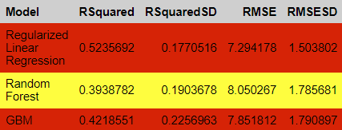
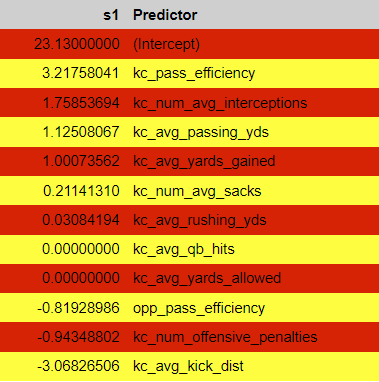

# ElectricTouch_Down {WIP}

## Project Overview
This project utilizes the nflfastR package to analyze Kansas City Chiefs data from the past ten seasons and build three different predictive models.

## Data
This project utilizes the [nflfastr](https://www.nflfastr.com/) package.

The following plot shows the Chiefs win-loss statistics by season. Their number of wins has been trending upward, and with the exception of 2012, the Chiefs typically win far more games than they lose each season.

The next plot shows the distribution of the play types by the Chiefs over the past 10 seasons.

## Predictors
Offensive and defensive measures wer calculated and used to build models to generate predictions of the Chiefs final score per game.

### Offensive Measures
* Average kick distance
* Passing efficiency
* Number of offensive penalties
* Average yards gained
* Average passing yards
* Average rushing yards

### Defensive Measures
* Average sacks
* Average yards allowed
* Average number of interceptions
* Opponent's passing efficiency
* Average QB hits

## Train/Test Split
A roughly 50/50 temporal splitting strategy was used to separate the data into a training and testing set. This gives the model real-world applicability, since we want to predict the scores in future seasons, not previous ones. The training data comes from the years 2012-2017 and the testing data comes from the years 2018-2022.

## Predictive Models
Three different predictive models were trained using the offensive and defensive predictors to predict the Chiefs final score in a game: regularized linear regression, random forest regression, and generalized boosted regression. All models were trained using cross validation with five folds. Hyperparameters were tuned for all models as well.

## Final Predictions
According to the one-standard deviation rule, evaluated on the RMSE, the regularized linear regression model achieved the best performance. Evaluated on the testing set, this model had an RMSE of 8.73. The following plot shows the model's true versus predicted values. The linear relationship indicates that the model was able to generalize to unseen data reasonably well.

The following QQ plot shows that the model is reliable and makes reasonable predictions because the residuals mostly follow a normal distribution.

## Recommendations
Based on the results of the final regularized linear regression model, I can conclude that the Chiefs would benefit from focusing on a few specific offensive and defensive strategies. The following Figure shows the coefficients of the model for each predictor. A positive coefficient indicates a positive correlation and vice versa. A coefficient of zero means the model effectively ignores the predictor because it has no impact on the prediction. 

The following figure shows the overall importance of each predictor to the model when it makes its predictions, where higher values are more important.

In terms of offense, the Chiefs will perform better if they increase their passing efficiency and decrease their kick distance and number of offensive penalties. Pass efficiency has the largest positive coefficient. Passing yards and yards gained are also high positive coefficients, but they are redundant with passing efficiency. The largest negative coefficient is kick distance, so the Chiefs should minimize this to perform best. Passing efficiency is the most important feature in the model. For defense, the Chiefs should focus on decreasing their opponents’ passing efficiency by increasing their number of interceptions and sacks. The number of interceptions is the most important for defense. 
	
These results intuitively make sense for the most part. Better passing efficiency will result in more yards gained and move the ball closer to the goal. Similarly, more interceptions and sacks on defense will decrease the Chiefs’ opposition’s passing efficiency, making them reach the goal posts more slowly. The model’s suggestion that decreasing kick distance will improve performance requires some critical thinking to understand. This likely indicates that the Chiefs should work on their response to a kick and strengthen their ability to re-engage with the ball, not losing control when it is kicked further.
